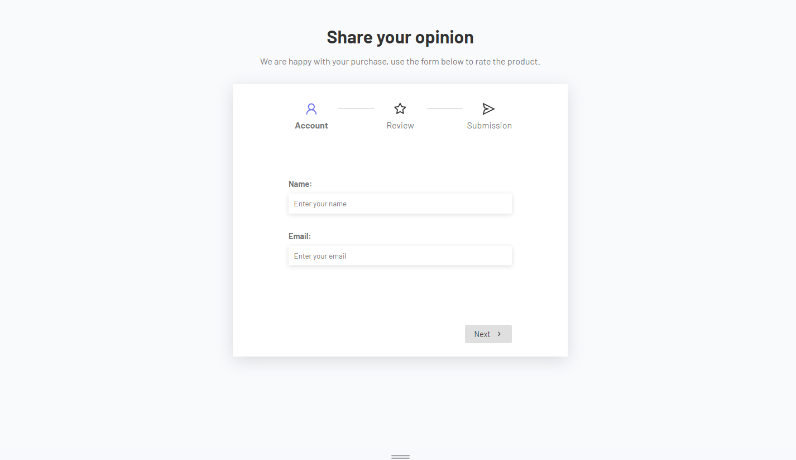
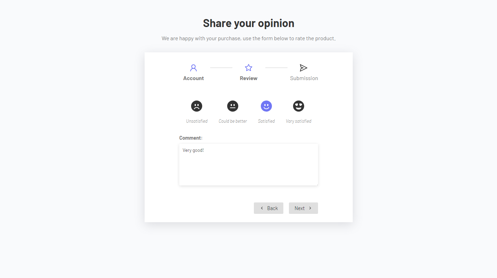
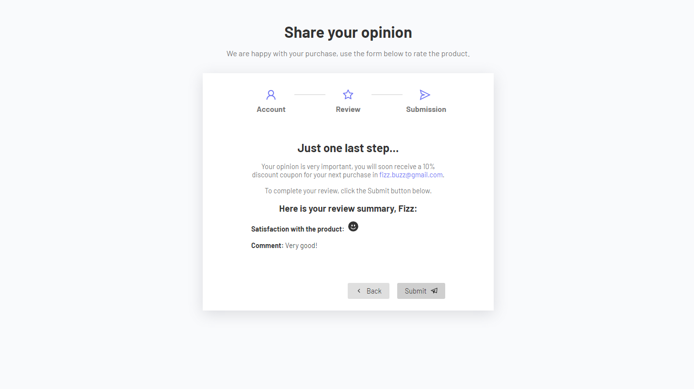

# Multistep Form

A simple static multistep form for product feedback. The app has three steps: in the first, the user needs to fill in their [`account`](https://github.com/mat-afk/multistep-form/blob/main/src/components/AccountForm.jsx) information; in the second, he can choose his level of satisfaction and leave a comment describing his [`review`](https://github.com/mat-afk/multistep-form/blob/main/src/components/ReviewForm.jsx); and lastly, he can check a [`summary`](https://github.com/mat-afk/multistep-form/blob/main/src/components/Thanks.jsx) of his assessment and submit. Using the "Back" button the user can return to the previous step, with persistent data.

During development, a customized Hook, [`useStep`](https://github.com/mat-afk/multistep-form/blob/main/src/hooks/useStep.jsx), was created, which allows the transition between steps and manages the components to be rendered in each of them.

Built with React and Vite, using [React Icons](https://react-icons.github.io/react-icons/).


## Getting Started

1. Clone this repository and enter it
    ```sh
    git clone https://github.com/mat-afk/multistep-form.git
    cd multistep-form
    ```
2. Install dependencies
   ```sh
   npm install react-icons
   ```

3. Run the app
   ```sh
   npm run dev
   ```

4. Open the indicated port to view it in the browser.


5. Fill the form and click on "Next" to go to the next step. 

6. Leave your review and click on "Next" to go to the next step.


7. Check the summary of your assessment and submit.
